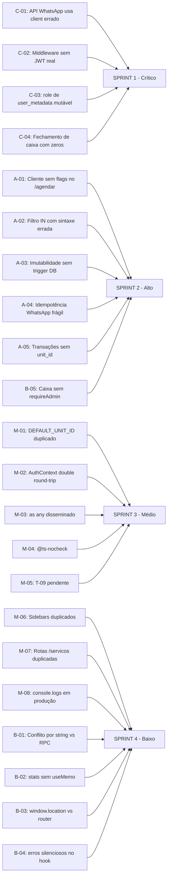

# Revisão Arquitetural — Otimiza Beauty

_Gerado em: 16/04/2026 | Revisor: Arquiteto (modo Architect)_

---

## Sumário Executivo

O sistema é um SaaS de gestão de salão de beleza construído em **Next.js 14 (App Router) + Supabase**. A arquitetura geral é adequada para o porte do produto, mas foram identificados **22 problemas** distribuídos em 6 categorias de severidade — da crítica (bloqueadores de produção) até melhorias de qualidade. Este documento detalha cada problema, sua localização exata no código e a correção recomendada.

---

## Diagrama de Arquitetura Atual

```mermaid
graph TD
    Browser -->|HTTPS| Middleware
    Middleware -->|cookie check| AdminPages[/admin/*]
    Middleware -->|cookie check| ApiAdmin[/api/admin/*]
    Middleware -->|x-api-key| WhatsApp[/api/whatsapp/*]
    AdminPages --> AuthContext
    AuthContext --> SupabaseBrowser[supabase browser client]
    ApiAdmin --> requireAdmin
    requireAdmin --> SupabaseSSR[supabase SSR server]
    WhatsApp --> SupabaseBrowser2[supabase browser client ERRADO]
    ApiAdmin --> createServerSupabase[service_role key]
    createServerSupabase --> Postgres[(Supabase Postgres)]
    SupabaseBrowser --> Postgres
```

---

## Problemas por Categoria

---

### 🔴 CRÍTICO — Bloqueadores de segurança e integridade de dados

---

#### C-01 — API WhatsApp usa o cliente *browser* no servidor

**Localização:** [`src/app/api/whatsapp/agendar/route.ts:20`](src/app/api/whatsapp/agendar/route.ts:20)

```typescript
// ERRADO — usa o singleton browser com anon_key em um API Route
import { supabase } from '@/lib/supabase';
```

**Problema:** O cliente importado é o `createBrowserClient` que usa a `anon_key`. Em um API Route (servidor), isso expõe operações que deveriam usar a `service_role key`. Mais grave: cria clientes sem `cadastro_completo = false` e sem `origem_cadastro = 'whatsapp'` (violação de RN-CLI-001 e T-03), pois o insert direto via `anon_key` pode ser bloqueado por RLS, fazendo o agendamento falhar silenciosamente.

**Correção:**
```typescript
// src/app/api/whatsapp/agendar/route.ts
import { createServerSupabase } from '@/lib/supabase-server';

// No handler POST:
const supabase = createServerSupabase();

// Ao criar cliente novo via robô:
await supabase.from('clientes').insert([{
  nome: cliente_nome,
  telefone: cliente_telefone || null,
  ativo: true,
  cadastro_completo: false,      // ← obrigatório (RN-CLI-001)
  origem_cadastro: 'whatsapp',   // ← obrigatório (T-03)
}]);
```

---

#### C-02 — Middleware valida autenticação apenas por presença de cookie — sem verificar JWT

**Localização:** [`src/middleware.ts:21-28`](src/middleware.ts:21-28)

```typescript
function hasSessionCookie(request: NextRequest): boolean {
  return request.cookies.getAll().some(
    (c) =>
      c.name.includes('auth-token') ||
      c.name.includes('sb-') ||
      c.name === 'supabase-auth-token'
  );
}
```

**Problema:** Qualquer cookie cujo nome contenha `sb-` passa pelo guard de `/admin`. Um atacante pode criar um cookie `sb-falso=qualquer-valor` e acessar todas as páginas admin. A proteção real está em `requireAdmin()`, mas **apenas nas rotas `/api/admin/*`** — as páginas SSR de `/admin/*` não têm verificação de JWT.

**Correção:** Substituir a verificação de string do cookie pelo método `@supabase/ssr` no middleware:

```typescript
// src/middleware.ts — usar createServerClient para validar JWT no edge
import { createServerClient } from '@supabase/ssr';

export async function middleware(request: NextRequest) {
  const response = NextResponse.next();
  const supabase = createServerClient(
    process.env.NEXT_PUBLIC_SUPABASE_URL!,
    process.env.NEXT_PUBLIC_SUPABASE_ANON_KEY!,
    { cookies: { getAll: () => request.cookies.getAll(), setAll: (c) => c.forEach(({ name, value, options }) => response.cookies.set(name, value, options)) } }
  );
  const { data: { user } } = await supabase.auth.getUser();
  if (!user && pathname.startsWith('/admin')) {
    return NextResponse.redirect(new URL('/login', request.url));
  }
  return response;
}
```

---

#### C-03 — `requireAdmin()` lê a `role` de `user_metadata` — mutável pelo próprio usuário

**Localização:** [`src/lib/api-auth.ts:61`](src/lib/api-auth.ts:61)

```typescript
const role = (user.user_metadata?.role as string) ?? 'client';
```

**Problema:** `user_metadata` pode ser modificado pelo próprio cliente via `supabase.auth.updateUser()`. Qualquer usuário pode elevar sua própria role para `admin` e chamar qualquer endpoint de `/api/admin/*` com sucesso.

**Correção:** Ler a role da tabela `public.users` (server-side, via `service_role`):

```typescript
// src/lib/api-auth.ts
const { data: userRow } = await supabase
  .from('users')
  .select('role')
  .eq('id', user.id)
  .single();

const role = userRow?.role ?? 'client';
```

---

#### C-04 — Fechamento de caixa não persiste os totais por método de pagamento

**Localização:** [`src/app/api/admin/caixa/route.ts:113-127`](src/app/api/admin/caixa/route.ts:113-127)

```typescript
.upsert([{
  // ...
  total_dinheiro: 0,         // ← sempre zero!
  total_cartao: 0,           // ← sempre zero!
  total_pix: 0,              // ← sempre zero!
  total_outros: total_liquido ?? 0,   // ← coloca tudo em "outros"
}])
```

**Problema:** O POST que fecha o caixa recebe apenas `total_bruto/desconto/liquido/comissoes` do cliente, mas não os totais por método. Os campos `total_dinheiro`, `total_cartao`, `total_pix` ficam zerados e `total_outros` recebe o total líquido inteiro. O relatório de fechamento fica incorreto.

**Correção:** Calcular os totais por método no servidor (no próprio POST), consultando a tabela `transacoes` antes de persistir — ou receber esses valores calculados pelo `FechamentoCaixaModal` que já os computa via GET.

```typescript
// src/app/api/admin/caixa/route.ts — POST
// 1. Buscar transações do dia (mesma lógica do GET)
// 2. Calcular total_dinheiro, total_cartao, total_pix, total_outros
// 3. Incluir no upsert
```

---

### 🟠 ALTO — Bugs de negócio com impacto em produção

---

#### A-01 — Criação de cliente novo via `/api/appointments` ignora campos de completude

**Localização:** [`src/app/api/appointments/route.ts:97-99`](src/app/api/appointments/route.ts:97-99)

```typescript
const { data: novoCliente } = await supabase
  .from('clientes')
  .insert([{ nome: client_name, telefone: client_phone, ativo: true }])
  // cadastro_completo e origem_cadastro ausentes
```

**Problema:** Clientes criados pela rota pública `/agendar` não recebem `cadastro_completo = false` nem `origem_cadastro`. O painel de pendências (T-09) não vai listá-los. Também usa `createServerSupabase` (service_role) — correto para bypass de RLS — mas deveria respeitar a regra T-03.

**Correção:** Adicionar os campos ao insert.

---

#### A-02 — `pacotes.ts` usa `(supabase as any)` com filtro `in()` com sintaxe inválida

**Localização:** [`src/services/pacotes.ts:30-31`](src/services/pacotes.ts:30-31)

```typescript
.filter('cliente_cpf', 'in', `("${cpf}","${cpfLimpo}")`)
```

**Problema:** A sintaxe correta do PostgREST para `IN` é `(val1, val2)` sem aspas duplas em torno dos valores de string — ou usar o método `.in()` do SDK. A query atual pode retornar zero resultados para CPFs com formatação, fazendo o sistema nunca encontrar pacotes ativos mesmo quando existem.

**Correção:**
```typescript
.in('cliente_cpf', [cpf, cpfLimpo])
```

---

#### A-03 — Imutabilidade de comanda não é enforçada no servidor

**Localização:** `spec.md RN-CMD-009`, `src/app/admin/comandas/page.tsx:56-64`

```typescript
// handleFecharComanda — fecha comanda diretamente sem verificar caixa
const { error } = await supabase
  .from('comandas')
  .update({ status: 'fechada', data_fechamento: new Date().toISOString() })
  .eq('id', comanda.id);
```

**Problema:** A regra RN-CMD-009 ("comanda em período com caixa fechado é imutável") não tem enforcement no servidor. O frontend pode bloquear, mas qualquer chamada direta ao Supabase (ou via Postman) ignora a restrição. Isso deve ser uma RLS policy ou trigger no banco.

**Correção:** Criar trigger PostgreSQL:

```sql
CREATE OR REPLACE FUNCTION check_comanda_caixa_fechado()
RETURNS TRIGGER AS $$
BEGIN
  IF EXISTS (
    SELECT 1 FROM fechamentos_caixa
    WHERE data_fechamento = NEW.data_fechamento::date
      AND status = 'fechado'
  ) THEN
    RAISE EXCEPTION 'Comanda pertence a período com caixa fechado';
  END IF;
  RETURN NEW;
END;
$$ LANGUAGE plpgsql;

CREATE TRIGGER trg_comanda_caixa_fechado
BEFORE UPDATE ON comandas
FOR EACH ROW EXECUTE FUNCTION check_comanda_caixa_fechado();
```

---

#### A-04 — Idempotência do WhatsApp usa `cliente_id` como chave — cliente pode não existir ainda

**Localização:** [`src/app/api/whatsapp/agendar/route.ts:148-157`](src/app/api/whatsapp/agendar/route.ts:148-157)

```typescript
const { data: agendamentoExistente } = await supabase
  .from('agendamentos')
  .select('id')
  .eq('cliente_id', cliente_id)       // ← cliente_id pode ser null se criação falhou
  .eq('data_agendamento', data)
  .eq('hora_inicio', hora_inicio)
  .neq('status', 'cancelado')
  .maybeSingle();
```

**Problema:** A chave de idempotência da spec (D-013) é `(telefone, servico_id, data, horario)`. A implementação usa `(cliente_id, data, hora_inicio)` sem `servico_id`. Se o telefone mudar de formato entre duas chamadas e resultar em `cliente_id` diferente, o agendamento é duplicado. Além disso, o `servico_id` não está sendo associado ao agendamento no INSERT (linha 205 — campo ausente).

**Correção:** 
1. Usar lookup por telefone normalizado + data + hora como chave de idempotência
2. Incluir `servico_id` no INSERT de agendamento

---

#### A-05 — Transações não têm `unit_id` — relatórios multi-tenant estão incorretos

**Localização:** [`src/app/api/admin/transacoes/route.ts:35-38`](src/app/api/admin/transacoes/route.ts:35-38) e [`src/app/api/admin/caixa/route.ts:70-73`](src/app/api/admin/caixa/route.ts:70-73)

A query de transações no GET do caixa não filtra por `unit_id`:
```typescript
.from('transacoes')
.select('valor, metodo')
.eq('tipo', 'receita')
.eq('data', data)
// sem .eq('unit_id', ...)
```

**Problema:** Se o sistema for usado por múltiplos tenants, o caixa de um tenant inclui as transações de outros. Mesmo em instância única, violação do modelo multi-tenant especificado.

**Correção:** Adicionar `unit_id` à tabela `transacoes` e filtrar em todas as queries.

---

### 🟡 MÉDIO — Débito técnico e inconsistências de design

---

#### M-01 — `DEFAULT_UNIT_ID` hardcoded como constante compartilhada

**Localização:** [`src/services/caixa.ts:2`](src/services/caixa.ts:2), [`src/app/api/admin/caixa/route.ts:4`](src/app/api/admin/caixa/route.ts:4)

```typescript
export const DEFAULT_UNIT_ID = '00000000-0000-0000-0000-000000000001';
```

**Problema:** O `DEFAULT_UNIT_ID` está definido em dois lugares (`caixa.ts` e `caixa/route.ts`) e exportado como constante de serviço — o que é um anti-pattern que vai mascarar bugs multi-tenant. A tabela `units` provavelmente não tem esta linha e queries com essa FK vão falhar em produção com constraint violation.

**Correção:** 
1. Centralizar em um único arquivo `src/lib/constants.ts`
2. O `unit_id` real deve vir da sessão autenticada do usuário (da tabela `users` → `unit_id`)
3. Criar a linha na tabela `units` se operar em modo single-tenant

---

#### M-02 — AuthContext faz dois round-trips desnecessários no login

**Localização:** [`src/contexts/AuthContext.tsx:80-103`](src/contexts/AuthContext.tsx:80-103)

No `loadUser`:
1. Primeiro seta a role do `user_metadata` (otimismo)
2. Depois faz fetch assíncrono da tabela `users` para corrigir

**Problema:** Cria uma "tela piscando" — o usuário vê o dashboard por ~200ms com a role errada antes de ser corrigido. E no `onAuthStateChange`, apenas `SIGNED_OUT` é tratado, ignorando `TOKEN_REFRESHED` e `SIGNED_IN` — que podem trazer roles atualizadas.

**Correção:** Aguardar o `fetchUserRole` antes de setar o estado, ou usar o resultado da tabela `users` como fonte única de verdade:

```typescript
const loadUser = async () => {
  const { data: { session } } = await supabase.auth.getSession();
  if (session?.user) {
    const { role, full_name } = await fetchUserRole(session.user.id, ...);
    setUser({ id: session.user.id, email: session.user.email, role, full_name });
    setRole(role);
  }
  setLoading(false);
};
```

---

#### M-03 — `(supabase as any)` disseminado — type safety comprometida

**Localização:** Múltiplos arquivos:
- [`src/services/pacotes.ts:26`](src/services/pacotes.ts:26)
- [`src/app/api/admin/caixa/route.ts:22`](src/app/api/admin/caixa/route.ts:22)
- [`src/app/api/admin/transacoes/route.ts:12`](src/app/api/admin/transacoes/route.ts:12)

**Problema:** O cast `as any` desabilita type-checking do Supabase SDK. Erros de schema (colunas renomeadas, tabelas removidas) só aparecem em runtime — não em build time. Isso é especialmente perigoso nas tabelas `pacotes_cliente`, `fechamentos_caixa` e `comissoes` que foram criadas recentemente e ainda não estão no tipo `Database`.

**Correção:** Regenerar os tipos com `supabase gen types typescript --linked > src/types/supabase.ts` e remover todos os `as any`. Adicionar isso ao CI/CD.

---

#### M-04 — API Route `/api/appointments` usa `// @ts-nocheck`

**Localização:** [`src/app/api/appointments/route.ts:1`](src/app/api/appointments/route.ts:1) e [`src/app/api/whatsapp/agendar/route.ts:1`](src/app/api/whatsapp/agendar/route.ts:1)

**Problema:** `@ts-nocheck` suprime TODOS os erros de TypeScript no arquivo, incluindo bugs reais. Identifica que o código foi escrito sem os tipos corretos e "consertado" suprimindo o compilador.

**Correção:** Remover o diretivo, gerar os tipos corretos, e usar typing explícito nos handlers.

---

#### M-05 — Task T-09 (painel de cadastros pendentes) ainda pendente

**Localização:** [`.specs/features/sistema-completo/tasks.md:440`](.specs/features/sistema-completo/tasks.md:440)

```
| T-09 | Frontend | T-03 ✅ | ⬜ Pendente |
```

**Problema:** O hook [`src/hooks/useCadastrosPendentes.ts`](src/hooks/useCadastrosPendentes.ts) foi implementado e está correto, mas não há nenhuma página que o consuma. O dashboard e a agenda não têm o card de pendências, e não há badge no menu lateral.

**Correção:** Implementar conforme spec T-09:
1. Card no `src/app/admin/dashboard/page.tsx`
2. Badge em `src/components/layout/AdminSidebar.tsx`
3. Link para `ClienteModal` com foco em CPF/data_nascimento

---

#### M-06 — Dois sidebars admin existem em paralelo sem uso claro

**Localização:** 
- [`src/components/layout/AdminSidebar.tsx`](src/components/layout/AdminSidebar.tsx)
- [`src/components/layout/AdminSidebarNew.tsx`](src/components/layout/AdminSidebarNew.tsx)

**Problema:** Dois componentes de sidebar coexistem. O "New" provavelmente substituiu o original mas o original não foi removido. Isso cria confusão sobre qual usar e risco de divergência.

**Correção:** Verificar qual está em uso no layout, remover o obsoleto, ou unificar.

---

#### M-07 — Página `/admin/servicos-new` e `/admin/servicos` coexistem

**Localização:** 
- [`src/app/admin/servicos/page.tsx`](src/app/admin/servicos/page.tsx)
- [`src/app/admin/servicos-new/page.tsx`](src/app/admin/servicos-new/page.tsx)

**Problema:** Mesma situação de M-06 — página "new" criada durante refatoração mas a original não foi removida. Navegação pode levar ao módulo errado.

---

#### M-08 — `console.log` de debug em componente de produção

**Localização:** [`src/components/modals/ComandaViewDrawer.tsx:40-44`](src/components/modals/ComandaViewDrawer.tsx:40-44)

```typescript
console.log('🔵 Drawer aberto com comandaId:', comandaId, 'Tipo:', typeof comandaId);
console.log('🔴 Drawer sem comandaId:', { isOpen, comandaId });
// ... e mais 4 console.logs no loadComanda
```

**Problema:** Logs de debug verbosos em produção expõem IDs internos e estrutura de dados no console do browser, além de degradar levemente a performance e poluir os logs.

**Correção:** Remover ou substituir por `console.debug` condicionado a `process.env.NODE_ENV === 'development'`.

---

### 🔵 BAIXO — Qualidade, manutenibilidade e conformidade com spec

---

#### B-01 — Verificação de conflito em `/api/appointments` usa comparação de string de horário

**Localização:** [`src/app/api/appointments/route.ts:76-79`](src/app/api/appointments/route.ts:76-79)

```typescript
.lt('hora_inicio', `${end_time}:00`)   // "09:30:00" — string comparison
.gt('hora_fim', `${start_time}:00`)
```

**Problema:** A comparação lexicográfica de strings `TIME` funciona corretamente no PostgreSQL (pois `TIME` é comparado como valor temporal), mas o `end_time` calculado no JS pode ter problemas de padding — ex: hora `8:5` em vez de `08:05`. A rota whatsapp usa RPC `verificar_conflito_horario_v2` que é mais segura.

**Correção:** Usar a mesma RPC `verificar_conflito_horario_v2` em todos os endpoints de criação de agendamento para consistência.

---

#### B-02 — Dados financeiros calculados no cliente sem cache

**Localização:** [`src/app/admin/comandas/page.tsx:102-107`](src/app/admin/comandas/page.tsx:102-107)

```typescript
const stats = {
  abertas: comandas.filter(c => c.status === 'aberta').length,
  totalAbertas: comandas.filter(c => c.status === 'aberta').reduce(...)
};
```

**Problema:** Stats são recalculados a cada render do componente sem `useMemo`. Em listas grandes (>100 comandas), isso causa re-computações desnecessárias.

**Correção:** Encapsular com `useMemo([comandas])`.

---

#### B-03 — `window.location.replace()` em vez de `router.replace()` no redirecionamento pós-login

**Localização:** [`src/contexts/AuthContext.tsx:75-78`](src/contexts/AuthContext.tsx:75-78)

```typescript
const redirectByRole = (userRole: UserRole) => {
  if (userRole === 'admin') window.location.replace('/admin');
  // ...
};
```

**Problema:** `window.location.replace` causa um hard reload completo da página, perdendo o estado do React. O correto é usar `router.replace()` do Next.js para navegação client-side.

**Correção:**
```typescript
const router = useRouter();
const redirectByRole = (userRole: UserRole) => {
  if (userRole === 'admin') router.replace('/admin');
  else if (userRole === 'professional') router.replace('/admin/agenda');
  else router.replace('/');
};
```

---

#### B-04 — `useCadastrosPendentes` ignora erros silenciosamente sem feedback

**Localização:** [`src/hooks/useCadastrosPendentes.ts:72`](src/hooks/useCadastrosPendentes.ts:72)

```typescript
} catch {
  // ignora silenciosamente — não bloqueia a UI
}
```

**Problema:** Erros de rede ou de DB são completamente suprimidos. O componente simplesmente mostra "0 pendentes" mesmo que a query tenha falhado por timeout ou problema de RLS.

**Correção:** Adicionar estado `error` e exibir um indicador sutil na UI (ícone de aviso no badge).

---

#### B-05 — `FechamentoCaixaModal` existe mas não há verificação de role admin antes de renderizar

**Localização:** [`src/components/modals/FechamentoCaixaModal.tsx`](src/components/modals/FechamentoCaixaModal.tsx) (não analisado em detalhes, mas padrão identificado)

**Problema:** O spec (RN-CXA-001) exige que apenas admin execute fechamento. A verificação deve ser tanto na UI quanto na API. A API em `POST /api/admin/caixa` não chama `requireAdmin()` — usa `createServerSupabase` diretamente sem verificação de role.

**Correção:** Adicionar `requireAdmin()` no início do POST e PATCH do caixa:
```typescript
export async function POST(req: NextRequest) {
  const authResult = await requireAdmin(req);
  if (authResult instanceof NextResponse) return authResult;
  // ...
}
```

---

## Mapa de Correções por Prioridade



---

## Tabela Consolidada

| ID | Severidade | Arquivo | Linha | Problema | Correção |
|----|-----------|---------|-------|----------|----------|
| C-01 | 🔴 Crítico | `api/whatsapp/agendar/route.ts` | 20 | Usa `supabase` browser no server, ignora flags de cliente | Trocar por `createServerSupabase()` + adicionar flags |
| C-02 | 🔴 Crítico | `middleware.ts` | 21-28 | Cookie check por string — bypassável | Usar `supabase.auth.getUser()` no middleware |
| C-03 | 🔴 Crítico | `lib/api-auth.ts` | 61 | role lida de `user_metadata` mutável pelo user | Ler da tabela `public.users` |
| C-04 | 🔴 Crítico | `api/admin/caixa/route.ts` | 113-127 | Total por método sempre zerado no fechamento | Calcular do DB no POST |
| A-01 | 🟠 Alto | `api/appointments/route.ts` | 97-99 | Cliente criado sem `cadastro_completo` e `origem_cadastro` | Adicionar campos ao INSERT |
| A-02 | 🟠 Alto | `services/pacotes.ts` | 30-31 | Sintaxe `.filter('in', '("x","y")')` inválida para string | Usar `.in('campo', [val1, val2])` |
| A-03 | 🟠 Alto | Banco de dados | — | Imutabilidade de comanda sem trigger | Criar trigger `trg_comanda_caixa_fechado` |
| A-04 | 🟠 Alto | `api/whatsapp/agendar/route.ts` | 148-207 | Idempotência fraca + `servico_id` não salvo | Chave por telefone+serviço+data+hora; incluir `servico_id` no INSERT |
| A-05 | 🟠 Alto | `api/admin/caixa/route.ts` | 70-73 | Transações sem filtro `unit_id` | Adicionar `unit_id` à tabela e filtros |
| B-05 | 🟠 Alto | `api/admin/caixa/route.ts` | 101, 140 | POST/PATCH sem `requireAdmin()` | Adicionar verificação de role no início dos handlers |
| M-01 | 🟡 Médio | `services/caixa.ts:2`, `api/admin/caixa/route.ts:4` | 2, 4 | `DEFAULT_UNIT_ID` duplicado e possivelmente inválido | Centralizar + buscar `unit_id` da sessão |
| M-02 | 🟡 Médio | `contexts/AuthContext.tsx` | 80-103 | Dois round-trips causam "role piscando" | Aguardar `fetchUserRole` antes de setar estado |
| M-03 | 🟡 Médio | `services/pacotes.ts`, `api/admin/*` | vários | `(supabase as any)` suprime type safety | Regenerar tipos, remover casts |
| M-04 | 🟡 Médio | `api/appointments/route.ts`, `api/whatsapp/agendar/route.ts` | 1 | `@ts-nocheck` suprime erros reais | Remover e tipar corretamente |
| M-05 | 🟡 Médio | `.specs/features/sistema-completo/tasks.md` | 440 | T-09 pendente — hook existe mas nenhuma UI consome | Implementar card no dashboard + badge no sidebar |
| M-06 | 🟡 Médio | `components/layout/` | — | Dois sidebars admin coexistem | Remover o obsoleto |
| M-07 | 🟡 Médio | `app/admin/servicos*/` | — | Duas rotas de serviços coexistem | Remover a obsoleta |
| M-08 | 🟡 Médio | `components/modals/ComandaViewDrawer.tsx` | 40-88 | Logs de debug em produção | Remover / condicionar a `dev` |
| B-01 | 🔵 Baixo | `api/appointments/route.ts` | 76-79 | Conflito por string em vez de RPC | Usar `verificar_conflito_horario_v2` |
| B-02 | 🔵 Baixo | `app/admin/comandas/page.tsx` | 102-107 | `stats` sem `useMemo` | Encapsular com `useMemo` |
| B-03 | 🔵 Baixo | `contexts/AuthContext.tsx` | 75-78 | `window.location.replace` em vez de `router.replace` | Usar `useRouter` |
| B-04 | 🔵 Baixo | `hooks/useCadastrosPendentes.ts` | 72 | Erros silenciosos sem feedback | Adicionar estado `error` |

---

## Ordem de execução recomendada

### Sprint 1 — Segurança (bloquear antes do próximo deploy)
1. **C-03** — corrigir `requireAdmin` para ler da tabela `users`
2. **C-02** — corrigir middleware para validar JWT real
3. **C-01** — corrigir API WhatsApp para usar `createServerSupabase`
4. **B-05** — adicionar `requireAdmin` no POST/PATCH do caixa

### Sprint 2 — Integridade financeira
5. **C-04** — corrigir fechamento de caixa (totais por método)
6. **A-05** — adicionar `unit_id` às transações
7. **A-03** — criar trigger de imutabilidade de comanda

### Sprint 3 — Bugs de negócio
8. **A-01** — flags de completude no `/api/appointments`
9. **A-02** — corrigir sintaxe do filtro `IN` em `pacotes.ts`
10. **A-04** — fortalecer idempotência do WhatsApp + `servico_id` no INSERT

### Sprint 4 — Débito técnico
11. **M-05** — implementar T-09 (painel de cadastros pendentes)
12. **M-01** — centralizar `unit_id`
13. **M-03 + M-04** — regenerar tipos e remover `as any` / `@ts-nocheck`
14. **M-02** — corrigir AuthContext double round-trip

### Sprint 5 — Polimento
15. **M-06, M-07** — remover arquivos duplicados
16. **M-08, B-01, B-02, B-03, B-04** — qualidade de código

---

_Este documento deve ser revisado e aprovado antes de iniciar a implementação. Para cada correção, criar uma PR separada com testes de regressão._
